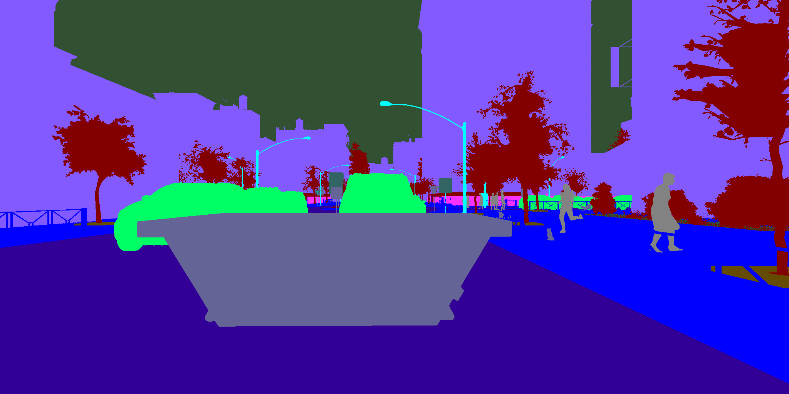

# DeepLabv3Plus-Pytorch

DeepLabV3 and DeepLabV3+ with MobileNetv2 and ResNet backbones for Pytorch.

## Results


|  Model          |      |mIoU | Mean Acc  |    Checkpoint    |
| :--------        | :-------------:    | :-----------:| :----: | :--------: |
| DeepLabV3Plus-ResNet101     |        | 82.6644   | 86.8975 |  [[GoogleDrive]](https://drive.google.com/file/d/1buUqaNxHOPcaSpO-nS1UTLTL2FkJAzHd/view)  [[HuggingFace]](https://huggingface.co/Xuanlong/MUAD_DeepLabmodel)   |  

<div>


</div>

<div>




</div>

## Quick Start

### 1. Requirements

```bash
pip install -r requirements.txt
```


### 2. Training on MUAD

```bash
CUDA_VISIBLE_DEVICES=0,1 python3 main.py \
--data_root "/path_to_muad_dataset/" \
--odgt_root "./datasets/data_odgt" \
--model "deeplabv3plus_resnet101" \
--output_stride 8 --batch_size 12 --crop_size 768 --gpu_id 0,1 --lr 0.1 --val_batch_size 2
```

### 3. Evaluate on MUAD validation set
Results will be saved at ./results if set --save_val_results

```bash
python evaluate_miou.py --data_root "/path_to_muad_dataset/" \
--odgt_root ./datasets/data_odgt/ \
--ckptpath ./checkpoints/best_deeplabv3plus_resnet101_muad_os8.pth \
--dataset muad --model deeplabv3plus_resnet101 --output_stride 8
```

### 3. Inference (generate outputs for UNCV MUAD challenge)
Here is an example for you to submit your results to UNCV MUAD challenge on Codalab. 
```bash
python challenge_example.py --data_root  "/path_to_challenge_test_leftImg8bit_folder/" \
--ckptpath ./checkpoints/best_deeplabv3plus_resnet101_muad_os8.pth \
--dataset muad --model deeplabv3plus_resnet101 --output_stride 8
```

```bash
cd ./submission/ && zip ../submission.zip * && cd ..
```
Then you can submit submission.zip to the corresponding place on the challenge page.

## Reference

[1] [MUAD: Multiple Uncertainties for Autonomous Driving, a benchmark for multiple uncertainty types and tasks](https://arxiv.org/abs/2203.01437)

[2] [Rethinking Atrous Convolution for Semantic Image Segmentation](https://arxiv.org/abs/1706.05587)

[3] [Encoder-Decoder with Atrous Separable Convolution for Semantic Image Segmentation](https://arxiv.org/abs/1802.02611)
